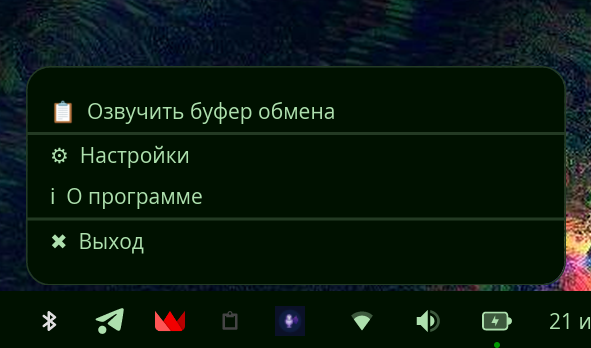
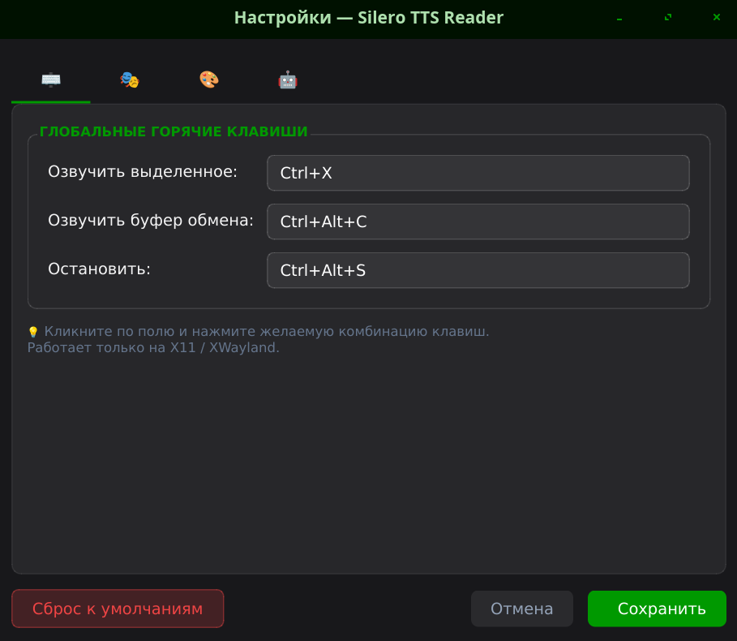
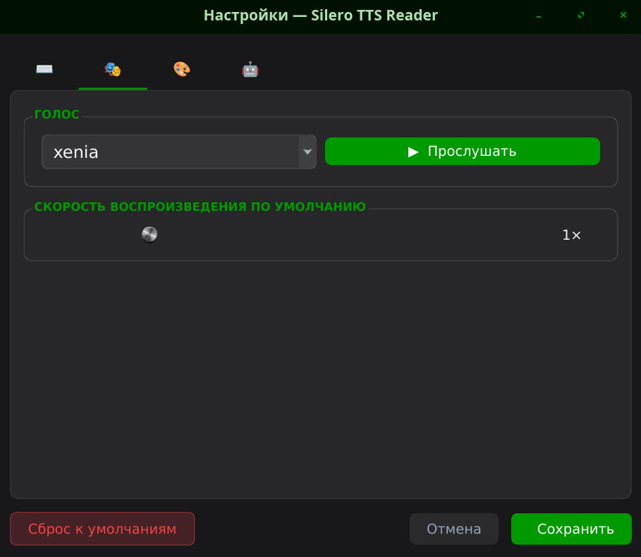
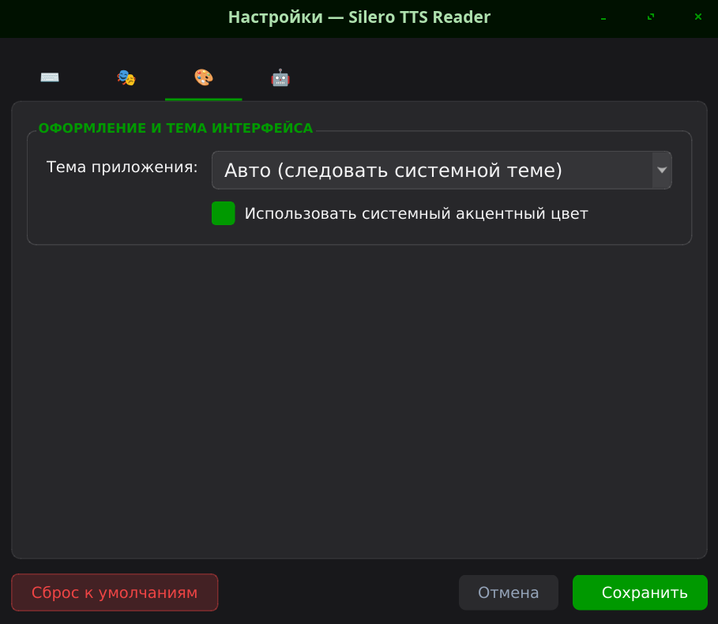
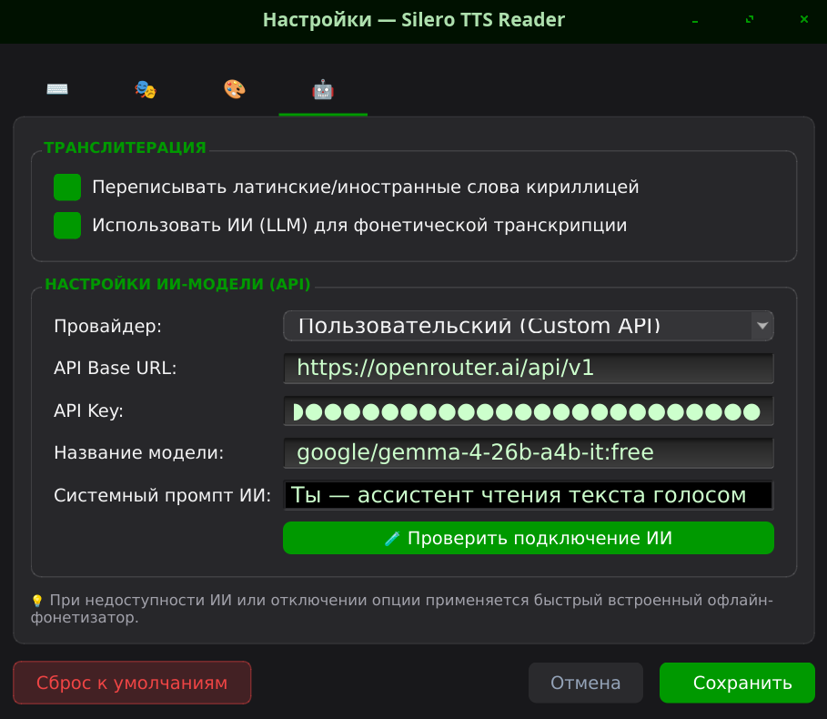

# Silero TTS Reader 🎙️🔊

[](https://www.python.org/)
[](https://pypi.org/project/PyQt6/)
[](https://silero.ai/)
[](LICENSE)
[-lightgrey.svg)](https://www.kernel.org/)

**Silero TTS Reader** — это современное, легкое и бытрое Linux-приложение для мгновенного озвучивания любого выделенного текста или содержимого буфера обмена с использованием нейросетевых моделей **Silero TTS v5**.

Приложение работает в фоновом режиме через системный трей, управляется глобальными горячими клавишами и предоставляет плавный плавающий виджет управления воспроизведением с возможностью гибкой регулировки скорости, перемотки и умной транслитерации.

---

## 📸 Скриншоты

<div align="center">

### Плавающий виджет воспроизведения

*Плавающее оверлейное окно с регулятором скорости, интерактивной полосой прогресса, кнопками перемотки и быстрой паузы*

</div>

<br>

| ⌨️ Глобальные горячие клавиши | 🎭 Настройки голоса и аудио |
| :---: | :---: |
|  |  |
| *Настройка комбинаций под X11 и Wayland* | *Выбор диктора и живой предпросмотр речи* |

| 🎨 Внешний вид и темы | 🤖 ИИ & Транслитерация |
| :---: | :---: |
|  |  |
| *Интеграция с системным акцентным цветом ОС* | *Настройка Ollama / OpenAI для фонетической записи* |

<div align="center">

### Иконка в системном трее

*Быстрое управление фоновым демоном и доступ к настройкам*

</div>

---

## ✨ Основные возможности

- ⚡ **Мгновенное озвучивание по хоткею**: Озвучивание выделенного в любой программе текста (`Ctrl+Alt+R`) или содержимого буфера обмена (`Ctrl+Alt+C`).
- ⏯ **Плавающий оверлейный виджет**:
  - Всегда поверх всех окон без захвата фокуса ввода.
  - Интерактивный таймлайн/прогресс-бар с возможностью перехода в любой момент аудио по клику мышью.
  - Кнопки быстрой перемотки назад и вперед (`◀◀` -5с / `▶▶` +5с).
  - Поддержка динамической паузы и возобновления.
- 🤖 **Интеллектуальная транслитерация (LLM + Offline)**:
  - **ИИ-транскрипция**: Интеграция с Ollama, OpenAI API или пользовательскими REST-эндпоинтами для адаптивного перевода иностранных брендов и терминов в кириллицу с точной простановкой ударений (например, `Python` → `Па+йтон`, `Google` → `Гу+гл`).
  - **Автономный фолбэк**: Встроенный правило-ориентированный словарь и фонетический транслитератор для 100% офлайн работы при отсутствии сети.
  - **100% Автономный конвертер чисел**: Локальное превращение любых арабских цифр, чисел, дат, процентов и дробей в числительные кириллицей (`2026` → `две тысячи двадцать шесть`, `100%` → `сто процентов`).
- 🎭 **Поддержка Silero TTS v5**:
  - Высококачественная генерация речи на русском языке (`xenia`, `kseniya`, `aidar`, `baya`, `eugene`).
  - Режим живого предпросмотра голоса прямо в настройках.
- 🎚 **Регулировка скорости (0.5x–3.0x)**: Изменение скорости речи в реальном времени с сохранением естественного тона голоса (требуется `rubberband`).
- 🎨 **Интеграция с оформлением системы**:
  - Автоматическое определение тёмной/светлой темы ОС.
  - Автоопределение и динамическое применение системного акцентного цвета (KDE / GNOME / COSMIC Desktop / Qt palette).
- 🐧 **Поддержка Wayland и X11**: Стабильная работа в Arch Linux, Ubuntu, Fedora, Debian и COSMIC Desktop.

---

## 🛠️ Системные требования

- **ОС**: Linux (Arch, Ubuntu/Debian, Fedora и др.)
- **Окружение**: X11 или Wayland (с включенным XWayland/evdev для глобальных хоткеев)
- **Python**: 3.10 или новее
- **Системные утилиты**:
  - `xdotool` и `xclip` — для эмуляции нажатий и считывания выделения
  - `rubberband-cli` — *(опционально)* для качественного изменения скорости речи

---

## 🚀 Быстрая установка

### Автоматическая установка (Рекомендуется)

Клонируйте репозиторий и запустите скрипт автоматической установки:

```bash
git clone https://github.com/Andrey4952/silero-tts-reader.git
cd silero-tts-reader
bash install.sh
```

Скрипт автоматически:
1. Определит ваш дистрибутив и установит системные зависимости (`xdotool`, `xclip`, `rubberband`).
2. Настроит права доступа udev для чтения клавиатурных событий глобальных хоткеев.
3. Скачает нейросетевую модель Silero TTS v5 (`v5_ru.pt`, ~145 МБ).
4. Создаст изолированное виртуальное окружение Python со всеми необходимыми пакетами.

### Ручная установка

#### 1. Установка системных зависимостей

* **Arch Linux / Manjaro**:
  ```bash
  sudo pacman -S xdotool xclip rubberband python-pyqt6 python-numpy python-pytorch-opt-cpu
  ```
* **Ubuntu / Debian**:
  ```bash
  sudo apt install xdotool xclip rubberband-cli python3-venv python3-pyqt6
  ```
* **Fedora**:
  ```bash
  sudo dnf install xdotool xclip rubberband python3-qt5
  ```

#### 2. Загрузка модели Silero TTS v5

```bash
mkdir -p ~/.local/share/silero-tts-reader
wget -O ~/.local/share/silero-tts-reader/v5_ru.pt \
  https://models.silero.ai/models/tts/ru/v5_ru.pt
```

#### 3. Настройка Python venv и зависимостей

```bash
python3 -m venv --system-site-packages .venv
source .venv/bin/activate
pip install -r requirements.txt pyrubberband
```

---

## 💻 Использование

### Запуск приложения

```bash
# Из папки репозитория
python run.py

# Или после установки скрипта в систему
silero-tts-reader
```

### Установка в систему и автозапуск

Для добавления приложения в меню приложений вашей ОС и автозапуска при входе в систему:

```bash
# Создание бинарного ярлыка в ~/.local/bin и .desktop файла
mkdir -p ~/.local/bin ~/.local/share/applications ~/.config/autostart

cat << 'EOF' > ~/.local/bin/silero-tts-reader
#!/usr/bin/env bash
exec /path/to/silero-tts-reader/.venv/bin/python /path/to/silero-tts-reader/run.py "$@"
EOF
chmod +x ~/.local/bin/silero-tts-reader

cp silero-tts-reader.desktop ~/.local/share/applications/
cp silero-tts-reader.desktop ~/.config/autostart/
```

Также доступен юнит **systemd** для фонового демона:
```bash
cp silero-tts-reader.service ~/.config/systemd/user/
systemctl --user daemon-reload
systemctl --user enable --now silero-tts-reader.service
```

---

## ⌨️ Горячие клавиши по умолчанию

| Действие | Горячая клавиша | Описание |
| :--- | :---: | :--- |
| **Озвучить выделенный текст** | <kbd>Ctrl</kbd> + <kbd>Alt</kbd> + <kbd>R</kbd> | Захватывает выделенный в любом окне текст и начинает воспроизведение |
| **Озвучить буфер обмена** | <kbd>Ctrl</kbd> + <kbd>Alt</kbd> + <kbd>C</kbd> | Читает текст из буфера обмена |
| **Остановить воспроизведение** | <kbd>Ctrl</kbd> + <kbd>Alt</kbd> + <kbd>S</kbd> | Мгновенно останавливает речь и скрывает виджет |

*Все горячие клавиши можно легко переназначить в окне настроек приложения (иконка в трее → Настройки).*

---

## ⚙️ Конфигурация

Файл настроек автоматически сохраняется по пути `~/.config/silero-tts-reader/config.json`.

Пример конфигурации:
```json
{
  "hotkey_speak_selection": "<ctrl>+<alt>+r",
  "hotkey_speak_clipboard": "<ctrl>+<alt>+c",
  "hotkey_stop": "<ctrl>+<alt>+s",
  "tts": {
    "model_path": "/home/user/.local/share/silero-tts-reader/v5_ru.pt",
    "speaker": "xenia",
    "sample_rate": 48000,
    "speed": 1.0
  },
  "appearance": {
    "theme_mode": "system",
    "use_system_accent": true
  },
  "transliteration": {
    "enabled": true,
    "use_llm": true,
    "provider": "ollama",
    "base_url": "http://localhost:11434/v1",
    "model": "llama3"
  }
}
```

---

## 🏗️ Структура проекта

```text
silero-tts-reader/
├── assets/
│   └── screenshots/         # Скриншоты интерфейса
├── silero_tts_reader/
│   ├── config/              # Менеджер конфигурации JSON
│   ├── core/                # Ядро: TTS Engine, Audio Player, LLM & Number Transliteration
│   ├── ui/                  # PyQt6 UI: Трей, Плавающий виджет, Окно настроек
│   └── app.py               # Главный контроллер приложения
├── install.sh               # Скрипт автоустановки
├── run.py                   # Точка входа для запуска
├── pyproject.toml           # Метаданные пакета
├── requirements.txt         # Зависимости Python
└── silero-tts-reader.desktop# Ярлык приложения
```

---

## 📜 Лицензия

Проект распространяется под лицензией **MIT**. Подробности в файле [LICENSE](LICENSE).
